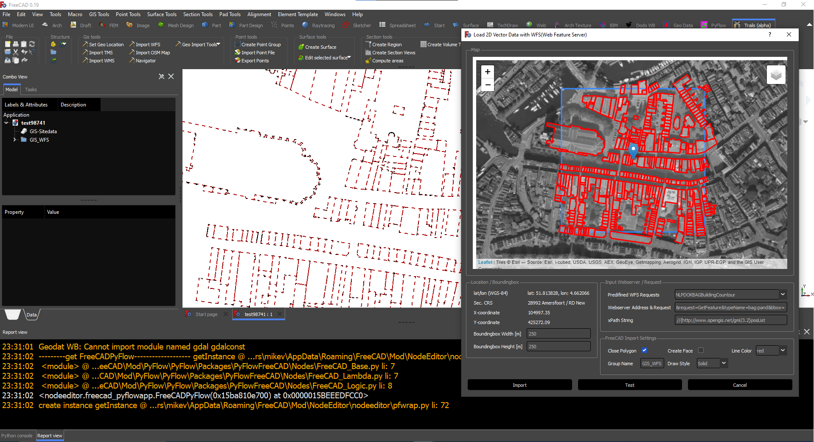

# FOSS-BIM-Experiments
Experiments with Open Source BIM Software

BAG 3D + BGT 2D in Den Haag(Netherlands) in FreeCAD

[[https://github.com/DutchSailor/FOSS-BIM-Experiments/blob/main/GIS2BIM/Images/GIS2BIM_BGT_BAG3D.png]]

WMS from Vlaarderen(Belgium) in FreeCAD

Web Feature Service(WFS) PoC in FreeCAD

Tile Map Service(TMS) in FreeCAD

Web Map Service(WMS) in FreeCAD

Geographic Location in FreeCAD

Map in FreeCAD using PySide2 and Leaflet map

Experiment 2D/3D GIS in FreeCAD

Experiment WFS-server in Blender with coordinates from BlenderGIS

